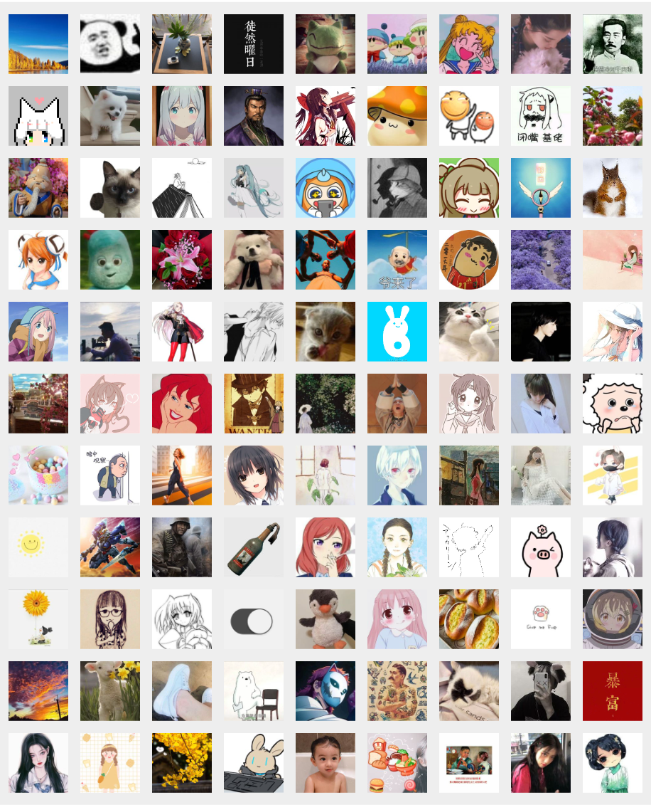

# WhoLikes

Who liked your Moments 朋友圈点赞统计工具

由于微信未提供朋友圈官方接口，WhoLikes 是一个基于图像识别的朋友圈点赞收集工具。它通过微信朋友圈点赞区域识别并记录点赞头像，从而帮助用户分析朋友圈点赞情况，包括谁点赞了你的朋友圈、点赞趋势以及互动频率等。

#### **核心功能亮点** ✨：

1. 将点赞记录存储到本地数据库，便于长期跟踪。
2. 支持多用户头像识别，基于历史记录进行相似度匹配，提高识别准确率。

#### 技术特点：

- 使用 Python 编写，使用了基于颜色分割和轮廓检测的方法进行图像识别和分割，并采用了网格化重构技术来定位和提取朋友圈点赞头像。
- 利用机器学习算法（如SIFT、SSIM）进行特征匹配，提升头像相似度识别的准确性。
- 可扩展的数据库设计，支持添加更多分析维度。

#### 使用方法：

- 目前需要手动截图朋友圈点赞区域并裁剪，保存图片到**images**文件夹，如下所示

- 运行run.py文件

#### 待扩展功能：

- 自动滚动朋友圈并识别点赞头像。
- 提供可视化数据分析，包括：
  - 每位好友的点赞次数统计（点赞榜）
  - 点赞时间分布（如一周内哪天点赞最多、一天中什么时段最活跃）
  - 朋友圈动态的点赞趋势变化
- 📊 **深度数据分析** 生成「朋友圈互动榜单」「周期性点赞趋势图」「高频点赞好友识别」等可视化报告
- ⏰ **时间轴回溯** 记录每次朋友圈发布的点赞时间线，追溯好友互动行为变化
